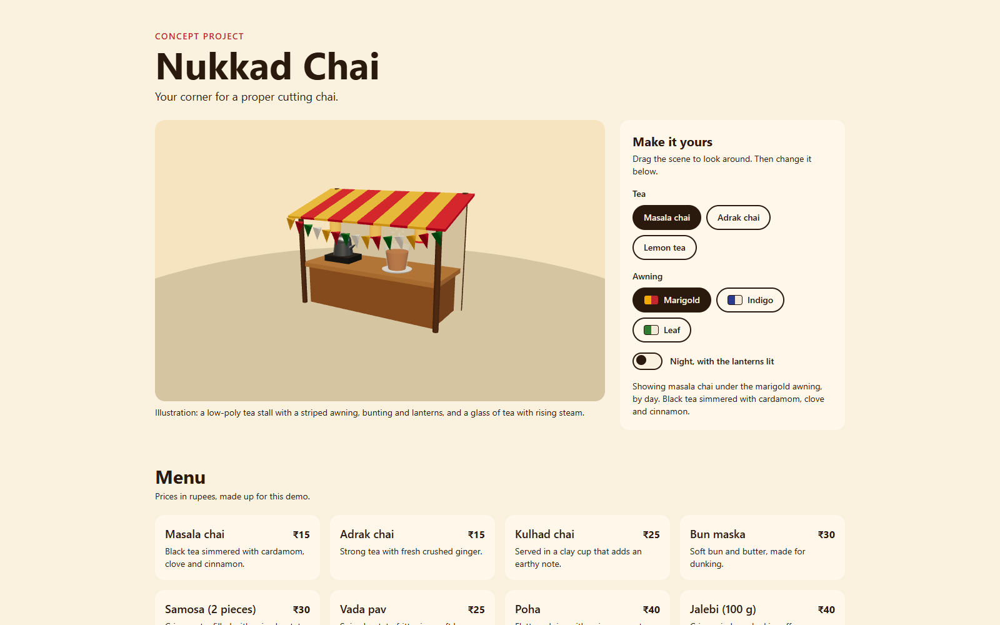

# Nukkad Chai

A concept project: a fast, accessible 3D landing page for a **fictional** street tea stall, with a live customiser (tea type, awning colour, day or night). Nukkad Chai is not a real business and the page shows no real address, phone number or email.

**Live:** https://imdps.github.io/nukkad-chai-3d/



## What it shows

- A real-time 3D scene (React Three Fiber) that reacts to HTML controls: choose the tea (liquid and steam change), the awning (stripes and bunting change) and day or night (lights dim, lanterns glow).
- A complete small-business page around it: menu, hours, events.
- Performance and accessibility handled on purpose, not left to chance.

## Measured results

Measured on the production build served locally, with Lighthouse 13.5.0 in headless Chrome. That browser draws WebGL on the CPU (software rendering), so the performance score and blocking time are indicative only. The frame rate rows below are a separate run on the live site (see the table). This is not a phone test.

| What | Result |
|---|---|
| Lighthouse desktop: performance / accessibility / best practices / SEO | 68 / 100 / 100 / 100 |
| Lighthouse mobile: performance / accessibility / best practices / SEO | 67 / 100 / 100 / 100 |
| Total transfer, as Lighthouse measured it from a local server | 393 KiB |
| Frame rate while orbiting, live site, desktop Chrome, day / night | 60.0 / 60.0 fps average (5th percentile 58.8 / 59.2), the display caps at 60 |
| Frame rate while orbiting, phone | not measured |

Why performance is 68 and 67: the total blocking time is 2.2 s on desktop and 6.2 s on mobile, which is the CPU drawing the 3D scene (single runs; an earlier run before the final fixes gave 1.5 s and 4.8 s when the glass dropped to the cheap material after about 11 s; now it stays on the full material, which probably costs more on a software renderer, not proven). With WebGL off (`?nowebgl`, the static fallback) the same mobile run scored 98 with 150 ms of blocking time and 145 KiB transferred (measured before the final fixes, not repeated). A real GPU should not behave like the software renderer, but that has not been measured here.

## How it works and why

- **Next.js static export, GitHub Pages:** no server, no keys, nothing to leak, and no running cost.
- **The scene is code, not assets:** the stall is built from boxes, cylinders and cones, the bunting is one instanced mesh, and the environment lighting is built from light panels. No models, textures, fonts or HDRI downloads, so the page stays light.
- **Two lights only:** one ambient and one directional light; lanterns glow through emissive materials.
- **Glass with a fallback:** the tea glass uses drei's transmission material with low samples and resolution, and drops to a cheap transparent material on weak devices (a performance monitor decides) and by default on touch devices.
- **Pauses off screen:** the render loop stops when the scene is not visible. Pixel ratio is capped at 1.5.
- **State in one place:** a small Zustand store holds the three choices. The HTML controls write it, the scene reads it. Colour and lighting changes ease in, or apply instantly for people who prefer reduced motion.
- **Accessible by default:** all content is real HTML; the controls are native radio buttons and a switch with a live status line; the scene is hidden from screen readers and described in a visible caption; without WebGL (or with `?nowebgl`) a static illustration replaces the scene and the customiser is hidden. A vertical swipe on the scene scrolls the page on a phone, and a horizontal drag orbits.
- **Tested where it counts:** unit tests cover the content rules, the store, easing, bunting layout, steam motion, and a scanner that fails the build if contact details ever appear in the built pages.

## Run it locally

```bash
npm install
npm run dev      # http://localhost:3000
npm run check    # lint, type-check and unit tests
npm run build    # static export into out/
```

Open the page with `?nowebgl` to force the no-WebGL fallback.

## Credits

Built with [Next.js](https://nextjs.org), [React](https://react.dev), [three.js](https://threejs.org), [React Three Fiber](https://github.com/pmndrs/react-three-fiber), [drei](https://github.com/pmndrs/drei), [Zustand](https://github.com/pmndrs/zustand) and [Tailwind CSS](https://tailwindcss.com), all MIT licensed. No third-party models, textures, images or fonts are used.

## Licence

MIT, see [LICENSE](LICENSE).
